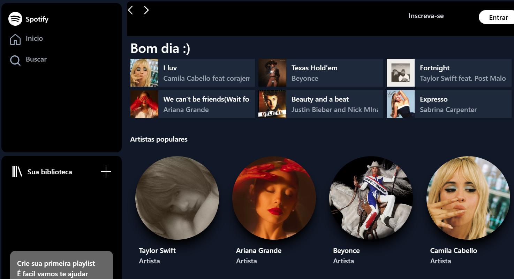
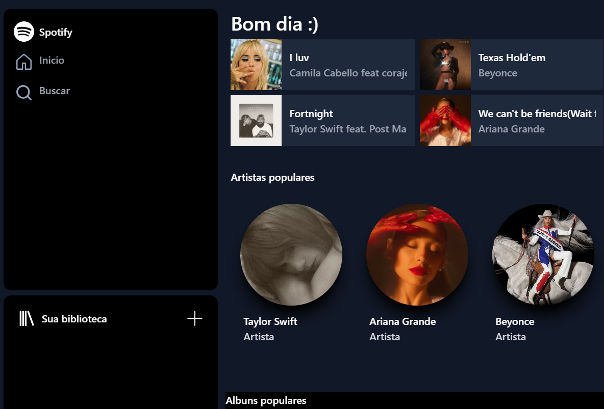
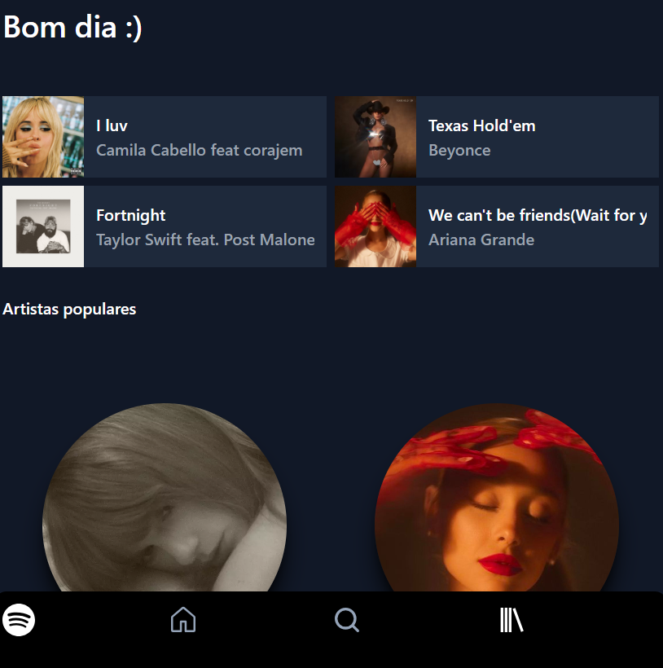

# spotify-tailwindcss
Este projeto consiste em uma réplica estilizada da página inicial do Spotify, desenvolvida utilizando o framework Tailwind CSS. O objetivo é recriar o visual moderno e responsivo da plataforma, demonstrando habilidades no uso de CSS utilitário e boas práticas de design front-end.

[**Réplica da Página Inicial do Spotify**]([https://play.tailwindcss.com/IgjQ57la3m?file=config](https://play.tailwindcss.com/IgjQ57la3m?layout=preview&file=config))

## Demonstração Responsiva

### Versão Desktop

### Versão Tablet

### Versão Mobile

